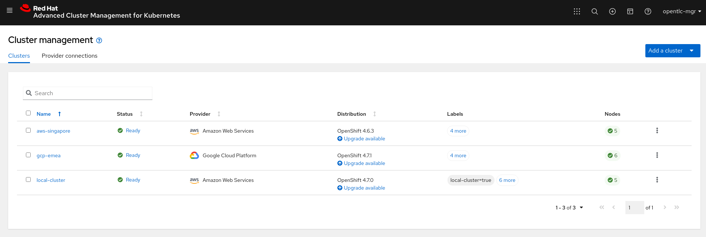
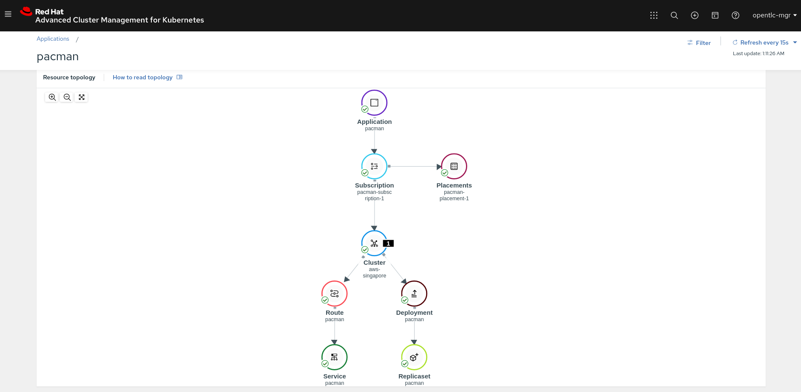
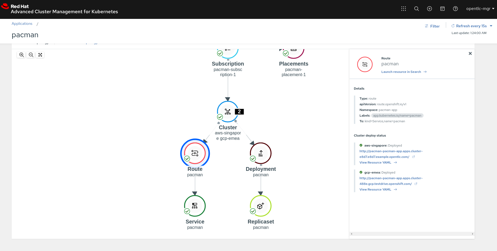

# Setup

## Provision OpenShift 4.6+ cluster.
Provision 2 or more OpenShift 4.6 or later clusters on RHPDS
- **Management_Cluster** will be used to host ACM and MongoDB

- **Pacman_Cluster** will be hosting the pacman application, steps to configure the **Pacman_Cluster** are the same

## Fork the repository

You would need to create your own repository for ACM to consume the deployment files.  

[Step 1] Fork the repository to your own account, the button is below your profile picture at the top right corner  


[Step 2] Edit the pacman-app.yaml file with your repository path name
 ```yaml
apiVersion: apps.open-cluster-management.io/v1
kind: Channel
metadata:
  name: pacman
  namespace: pacman-app
  labels:
    app.kubernetes.io/name: pacman
  annotations:
    apps.open-cluster-management.io/github-path: deploy
spec:
  type: GitHub
  pathname: {{ Put_your_repo_pathname_here }}
  ```

[Step 3] Push new edits to your git repository

## Deploy RHACM on the **Management_Cluster**

Deploy RHACM on Management_Cluster from operator hub


Follow the Steps and create a Default MultiClusterHub


Import the **Pacman_Cluster** on ACM, follow the steps accordingly


Wait for the cluster to come up, after **Pacman_Cluster** is ready you should see something like this



## Deploy MongoDB at **Management_Cluster**

Apply the policies under `mongodb/`.

  ```bash
  cd mongodb
  oc create namespace mongo
  oc apply -f mongo-deployment.yaml
  oc apply -f mongo-lb-service.yaml
  oc apply -f mongo-pvc.yaml
  oc apply -f mongo-route.yaml
  ```
## Edit the pacman deployment
* Get the service loadbalancer hostname


```bash
oc get service/mongo-lb -o=jsonpath='{.status.loadBalancer.ingress[0].hostname}' -n mongo
```
* Update the pacman deployment file pacman-deployment.yaml with the ELB hostname.

```bash
vi pacman-deploy.yaml
```

```yaml
spec:
  hostNetwork: true
    containers:
    - image: quay.io/jpacker/nodejs-pacman-app:green
      env:
      - name: MONGO_SERVICE_HOST
        value: "UPDATE_SERVICE_LOADBALANCER_HOSTNAME_HERE"
      - name: MY_MONGO_PORT
        value: "27017"
      name: pacman
      ports:
      - containerPort: 8080
        name: http-server
```
  * Push all edits to git

## **Pacman_Cluster** setup
* Create pacman-app namespace
* Allow higher privilege for default user in pacman-app namespace

```bash
  oc create namespace pacman-app
  oc project pacman-app
  oc adm policy add-scc-to-user privileged system:serviceaccount:pacman-app:default
```

## Deploy Application/Subscription/PlacementRule on **Management_Cluster**
```bash
  oc apply -f pacman-app.yaml
  ```

You should see the application waiting to be deployed, application cant be deployed as it does not fulfil the placement rule which we will do that in the next step


## Add in the cluster label
Add the cluster label for **Pacman_Cluster** from ACM UI
### Steps: 
1. From ACM
2. Click left menu > "Automated infrastructure" > "Clusters"
3. Click on the 3 Dots on the right of the **Pacman_Cluster**
4. Input the Label & Save
```bash
app.kubernetes.io/name=pacman
```


ACM will start to rollout the application deployment on the **Pacman_Cluster**



## Play the game

Access the Game from the route deployed


Play the Game!!  


You should notice a few things:
- The **Pacman_Cluster** Cloud provider's name
- Zone that the **Pacman_Cluster** is in
- Once you click out of the game you can see the live scores of players playing the game
- If you finish the game (Lose all 3 lives) you can see the highscore/Leaderboard

## [WIP Ansible Integration]

### LoadBalancer Integration

Sample HAProxy configiration file (haproxy.cfg) to loadbalance between two or more clusters
* Edit file accordingly
```bash
backend app
    balance static-rr
    option httpchk GET / HTTP/1.1\r\nHost:\ {{ app domain name }}
    http-request set-header Host {{ app domain name }}
    
    mode http
      server aws {{ ocp console route }}:80 check inter 1s downinter 1s fall 1 rise 1 weight 10 #aws
      server aro {{ ocp console route }}:80 check inter 1s downinter 1s fall 1 rise 1 weight 10 #aro
```

## [WIP Tekton Integration]


# References

Github repos refrenced
- https://github.com/mdelder/k8s-pacman-app.git
- https://github.com/jnpacker/pacman
- [github.com/open-cluster-management/deploy](https://github.com/open-cluster-management/deploy)
- [Ansible Tower containerized install method](https://releases.ansible.com/ansible-tower/setup_openshift/)


